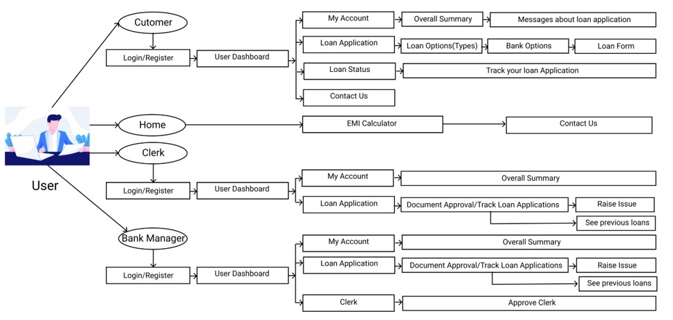

<h1 align="center">Centralized Banking Application</h1>
<h3 align="center">A centralized platform to get loan at the best ROI and resolve all the loan related queries</h3>
  

<h3 align="center">
Project Documentation
</h3> 

  
<ul>
<li>With the onset of the technological revolution, India has immensely grown in the technological sector and we are trying to make maximum of our tasks online as it is easier to track as well as manage things digitally.</li>
<li>In this technological era, our financial institutions have also shifted many of their tasks online which in turn has resulted in increased efficiency of work and peace of mind at both the customer and the officials end.</li>
<li>The number of consumers with loans rose to 6.54 crores as of December 2017, from 5.27 crore a year earlier.</li>
<li>Using our tool, we aim to make the current loan application more efficient by saving time both of customer and the bank officials.Its features are-</li>
</ul>
<ol>
<li>Created a  centralized platform where a customer can explore a wide variety of bank options offering loans at different interest.</li>
<li>Single platform to track outstanding loan and credit history of a person.</li>
<li>Document verification task fully automated where all the details like salary, tax, name, phone number is directly fetched from the pay slip and Aadhar Card api.</li>
<li>User can pay his/her loan from their wallet.Amount can be added in wallet through Razorpay api.</li>
<li>The bank manager or clerk has also been given a right to reject or send the document submitted by customer back for revision in case he/she finds any fault.</li>
<li>Any user having Pan Number and account on our platform can directly apply for a loan regardless of the bank he/she is having account.</li>
</ol>

<h3 align="center">Unique Features</h3>

<ol>
<li>User-centric approach where all the users (Customer, Clerk or Bank Manager) are allocated separate dashboards to showcase all details at one go.</li>
<li>Links all the banks account and loan details of borrower and creates a one stop platform for loan management.</li>
<li>End to end data security and prevent documents privacy as all the data is stored in encrypted (binary form) form using python.</li>
<li>User will be provided with unique Customer id at the time of registration from which they can apply for loans in various banks and would not require to create a new account.</li>
<li>Decrease the time for clerk and manager for document verification as our platform will auto verify all details from Aadhar api and salary slip.</li>
<li>Software has an inbuilt wallet system via which all transactions are handled through Razorpay
(From giving loan to borrower and paying EMI to bank).</li>
</ol>
 
 

<h3 align="center">Steps for installation</h3>

<ol>
<li>Install all the dependencies stored in requirements.txt (For installing dlib library you need to install visual studio and cmake first).</li>
<li>Change directory to Fintech-Razorpay.</li>
<li>Run app.py.</li>
<li>Open http://127.0.0.1:5000/ in browser.</li>
</ol>
 
 

<!-- 
<h4 align="center"><b>Video Demonstartion can be found<a href="#">here</a>.</b></h4>
 
   
-->

<h3 align="center">Tech stack</h3>

     
  

   
  
<b>Thank you for your time.</b> 
  

